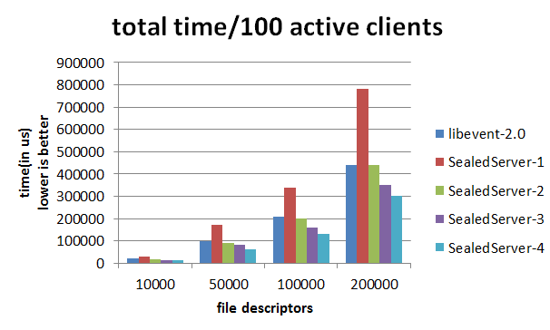
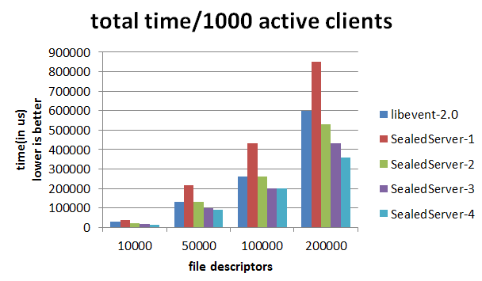

SealedServer
======
SealedServer is A light-weight network programming framework, and supports time and I/O events. I will also provide support for signal event `in near future`. I have used this framework to build the [CComet](https://github.com/mathetian/CComet).

## Features
1. Native support multiple-threading Selector
2. Mutliple Demux Threads and each thread can proceed tasks individual
3. Reactor pattern for event-driven
4. Only support synchronous I/O and Time events
5. Provide a simple Garbage Collection. Mainly taken the idea from nmstl.
6. Only header files are provided. Don't need pre-build.
</ul>

Our work is mainly inspired by [dirlt](http://dirlt.com/‎), [hpserver](http://code.google.com/p/hpserver/), [<span color="red">nmstl</span>](http://nmstl.sourceforge.net/) and [libevent](http://libevent.org). Especially, I adopted some concepts from [yohub](https://github.com/kedebug/yohub). Thanks again for open-source group.

## Benchmark
In this part, I will give out the comparison between our framework and libevent.

The benchmark is very simple: first a number of socket pairs is created, then event watchers for those pairs are installed and then a (smaller) number of "active clients" send and receive data on a subset of those sockets.

The benchmark program used was test/bench_library.c, taken from the libevent distribution, modified to using the api provided by SealedServer.

```
SealedServer:   version 1.0
Date        :   Wed Feb 13 16:14:09 2014
CPU         :   4 * Intel(R) Core(TM) i5-3317U CPU @ 1.70GHz
CPUCache    :   3072 KB
G++         :   4.8.1
libevent    :   2.0
Demux       :   EPoll
```

Each run of the benchmark program consists of two iterations outputting the total time per iteration as well as the time used in handling the requests only. The program will be run in different atomsphere, especially, use different number of threads.




In the above graph, the X of SealedServer-X means the number of threads created by bench_library.

The two graphs above show the overall time spent for different atomsphere. The top row represents 100 active clients (clients doing I/O), the bottom row uses 1000. All graphs have a logarithmic fd-axis to sensibly display the large range of file descriptor numbers of 10000 to 200000 (in reality, its actually socket pairs, thus there are actually twice the number of file descriptors in the process).

<h3>Discussion</h3>

The total time of our framework will be better than libevent when we use at least two threads. In my computer, we can achieve a 40% performance boost at most.

## Usage
How to use it? I have written a simple echo server-client in directory `tests`. 

## Design Principle

1. Design by manually. Don't use any advanced library directly. So thread library, atomic, callback, garbage collection and many others has been provided.
2. ...